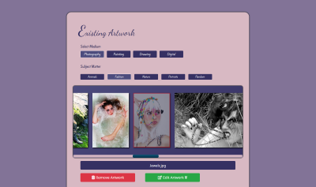

# Gallery Site for Multimedia Artist Kayla Kossajda

A full stack application for an artist to keep all her favorite artworks from her many disciplines in one place.

### Technology Stack

- Node.js
- Express
- EJS
- Google Cloud Storage
- MongoDB

## Description of Application

Keeping all of her art in different social media profiles was too much to organize, and made it difficult to show potential employers and clients her work and skillset. This application was designed to have all her work organized in one central location and to allow her to make changes as necessary.

Now, she can direct anyone to her site, and they can easily see what they're looking for.

The artist can login to create, read, update, and delete any artwork on the site. The UI automatically lays out any new or updated art into pages and sections organized by medium and category, and removes the deleted items.

Artwork data is persisted by Google Cloud Storage, and user login information is stored with MongoDB.

All the thumbnails on the site are generated upon upload and are low resolution for maximum site performance, however, any image can be clicked on to view to full resolution file which is often larger than any screen size, giving the user the full experience of the art.

### Hosting

The current version of this site can be found at https://kaylakossajda.com
